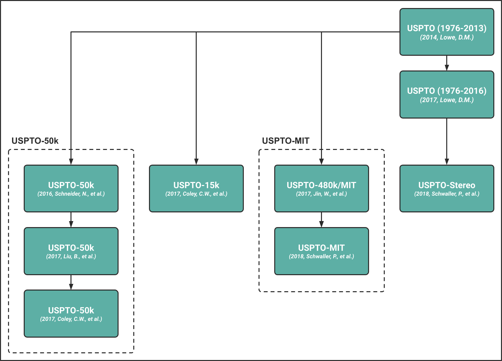

# Chemical Reaction Data
This project introduces a comprehensive yet lightweight package to facilitate downloading, extraction and preparation
of chemical reaction information data.


## Setup
To use the ***chemical_reaction_data*** package, please ensure that the
[ord-schema](https://github.com/open-reaction-database/ord-schema), [py7zr](https://github.com/miurahr/py7zr),
[tqdm](https://github.com/tqdm/tqdm), and [rdkit](https://github.com/rdkit/rdkit) libraries are available. A minimal
execution environment can be set up using [conda](https://docs.conda.io/en/latest/) and
[pip](https://pip.pypa.io/en/stable/) as follows:

```shell
conda create -c conda-forge -n chemical-reaction-data rdkit -y

conda activate chemical-reaction-data

pip install ord-schema py7zr tqdm
```


## Supported Data Sources
Currently, the ***chemical_reaction_data*** package supports the following chemical reaction information data sources:

1. [The United States Patent and Trademark Office Dataset](#the-united-states-patent-and-trademark-office-dataset)
2. [The Open Reaction Database](#the-open-reaction-database)
3. [The Rhea Database](#the-rhea-database)
4. [The RetroRules Database](#the-retrorules-database)
5. [Miscellaneous Data Sources](#miscellaneous-data-sources)


### 1. The United States Patent and Trademark Office Dataset
The **United States Patent and Trademark Office** dataset [[1]](#References) (USPTO) is an open-source chemical
reaction information dataset constructed by text-mining patent grant and patent application documents.



Currently, the ***chemical_reaction_data*** package supports the following USPTO versions:

| Version           | Reference                                                                 | Status                                                          |
|-------------------|---------------------------------------------------------------------------|-----------------------------------------------------------------|
| USPTO (1976-2013) | [(2014, Lowe, D.M.)](https://doi.org/10.6084/m9.figshare.12084729.v1)     | :orange_circle: Partially Implemented (Performance Limitations) |
| USPTO-50k         | [(2016, Schneider, N., et al.)](https://doi.org/10.1021/acs.jcim.6b00564) | :green_circle: Implemented                                      |
| USPTO-15k         | [(2017, Coley, C.W., et al.)](https://doi.org/10.1021/acscentsci.7b00064) | :green_circle: Implemented                                      |
| USPTO (1976-2016) | [(2017, Lowe, D.M.)](https://doi.org/10.6084/m9.figshare.5104873.v1)      | :green_circle: Implemented                                      |
| USPTO-50k         | [(2017, Liu, B., et al.)](https://doi.org/10.1021/acscentsci.7b00303)     | :red_circle: Not Implemented                                    |
| USPTO-50k         | [(2017, Coley, C.W., et al.)](https://doi.org/10.1021/acscentsci.7b00355) | :green_circle: Implemented                                      |
| USPTO-MIT         | [(2017, Jin, W., et al.)](https://doi.org/10.48550/arXiv.1709.04555)      | :green_circle: Implemented                                      |
| USPTO-MIT         | [(2018, Schwaller, P., et al.)](https://doi.org/10.1039/C8SC02339E)       | :red_circle: Not Implemented (Download Limitations)             |
| USPTO-Stereo      | [(2018, Schwaller, P., et al.)](https://doi.org/10.1039/C8SC02339E)       | :red_circle: Not Implemented (Download Limitations)             |


### 2. The Open Reaction Database
The **Open Reaction Database** [[2]](#References) (ORD) is an open-source chemical reaction information database
designed to support machine learning and related efforts in chemical reaction prediction, chemical synthesis planning,
and experiment design. Currently, the ***chemical_reaction_data*** package supports the following ORD versions:

| Version | Reference                                                             | Status                     |
|---------|-----------------------------------------------------------------------|----------------------------|
| ORD     | [(2021, Kearnes, S.M., et al.)](https://doi.org/10.1021/jacs.1c09820) | :green_circle: Implemented |


### 3. The Rhea Database
The **Rhea** database [[3]](#References) (RheaDB) is an open-source expert-curated knowledgebase of chemical and
transport reactions of biological interest. Currently, the ***chemical_reaction_data*** package supports the following
RheaDB versions:

| Version | Reference                                                          | Status                     |
|---------|--------------------------------------------------------------------|----------------------------|
| RheaDB  | [(2022, Bansal, P., et al.)](https://doi.org/10.1093/nar/gkab1016) | :green_circle: Implemented |


### 4. The RetroRules Database
The **RetroRules** database [[4]](#References) (RetroRulesDB) is an open-source database of chemical reaction rules
for metabolic pathway discovery and metabolic engineering. Currently, the ***chemical_reaction_data*** package supports
the following RetroRulesDB versions:

| Version             | Reference                                                        | Status                     |
|---------------------|------------------------------------------------------------------|----------------------------|
| RetroRulesDB (rr01) | [(2018, Duigou, T., et al.)](https://doi.org/10.1093/nar/gky940) | :green_circle: Implemented |
| RetroRulesDB (rr02) | [(2018, Duigou, T., et al.)](https://doi.org/10.1093/nar/gky940) | :green_circle: Implemented |


### 5. Miscellaneous Data Sources
Currently, the ***chemical_reaction_data*** package supports the following miscellaneous data sources:

| Data Source                                                     | Reference                                                               | Status                     |
|-----------------------------------------------------------------|-------------------------------------------------------------------------|----------------------------|
| Chemical Reaction Classification Dataset [[5]](#References)     | [(2013, Kraut, H., et al.)](https://doi.org/10.1021/ci400442f)          | :green_circle: Implemented |
| Organic Chemistry Textbook Questions Dataset [[6]](#References) | [(2016, Wei, J.N., et al.)](https://doi.org/10.1021/acscentsci.6b00219) | :green_circle: Implemented |
| RetroTransformDB Dataset [[7]](#References)                     | [(2018, Avramova, S., et al.)](https://doi.org/10.3390/data3020014)     | :green_circle: Implemented |


## License Information
This project is published under the [MIT License](/LICENSE). For more details on the license information of individual
data sources, please refer to the original publications.


## Contact
If you are interested in contributing to this project by reporting bugs, submitting feedback or anything else that
might be beneficial, please feel free to do so via GitHub issues or [e-mail](mailto:hasic@cb.cs.titech.ac.jp).


## References
1. Lowe, D.M. **Extraction of Chemical Structures and Reactions from the Literature**. *Ph.D. Thesis, University of
   Cambridge, Department of Chemistry, Pembroke College*, 2012. DOI: https://doi.org/10.17863/CAM.16293.
2. Kearnes, S.M., Maser, M.R., Wleklinski, M., Kast, A., Doyle, A.G., Dreher, S.D., Hawkins, J.M., Jensen, K.F., and
   Coley, C.W. **The Open Reaction Database**. *J. Am. Chem. Soc.*, 2021, 143, 45, 18820–18826.
   DOI: https://doi.org/10.1021/jacs.1c09820.
3. Bansal, P., Morgat, A., Axelsen, K.B., Muthukrishnan, V., Coudert, E., Aimo, L., Hyka-Nouspikel, N., Gasteiger, E.,
   Kerhornou, A., Neto, T.B., Pozzato, M., Blatter, M., Ignatchenko, A., Redaschi, N., and Bridge, A. **Rhea, the
   Reaction Knowledgebase in 2022**, *Nucleic Acids Research*, 2022, 50, D1, D693–D700.
   DOI: https://doi.org/10.1093/nar/gkab1016.
4. Duigou, T., du Lac, M., Carbonell, P., and Faulon, J. **RetroRules: A Database of Reaction Rules for Engineering
   Biology**, *Nucleic Acids Research*, 2018, 47, D1, D1229–D1235. DOI: https://doi.org/10.1093/nar/gky940.
5. Kraut, H., Eiblmaier, J., Grethe, G., Löw, P., Matuszczyk, H., and Saller, H. **Algorithm for Reaction
   Classification**, *J. Chem. Inf. Model.*, 2013, 53, 11, 2884–2895. DOI: https://doi.org/10.1021/ci400442f.
6. Wei, J.N., Duvenaud, D., and Aspuru-Guzik, A. **Neural Networks for the Prediction of Organic Chemistry 
   Reactions**, *ACS Cent. Sci.*, 2016, 2, 10, 725–732. DOI: https://doi.org/10.1021/acscentsci.6b00219.
7. Avramova, S., Kochev, N., and Angelov, P. **RetroTransformDB: A Dataset of Generic Transforms for Retrosynthetic 
   Analysis**, *Data*, 2018, 3, 2. DOI: https://doi.org/10.3390/data3020014.
